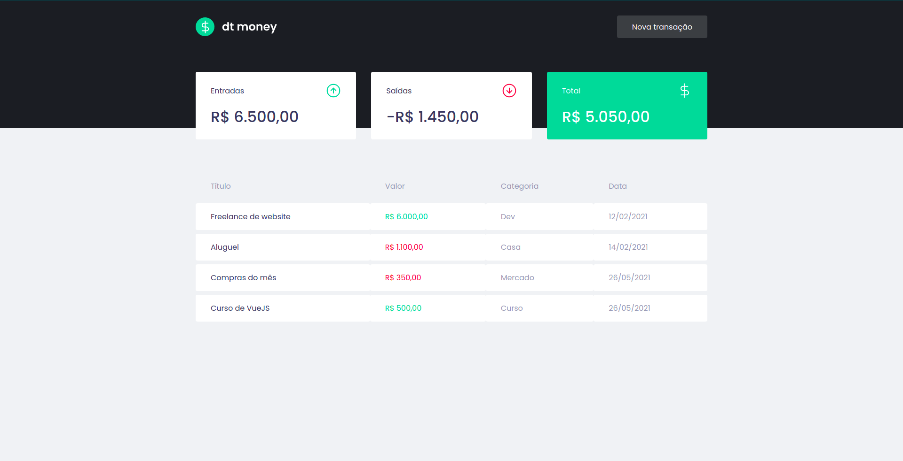

# dt money

<div align="center">
  
</div>

## 📃 About

Dt money is a simple and effective alternative to manage your finances, allowing the registration of entries, exits and the organization of them in categories.

## 🖥 Tecnologies

This project was developed using cutting edge front-end technologies.

- [Vue](https://vuejs.org/)
- [Vuex](https://vuex.vuejs.org/)
- [Stylus](https://stylus-lang.com/)
- [MirageJS](https://miragejs.com/)

## 🚀 Getting started

### Requirements

- You need to install both [Node.js](https://nodejs.org/en/download/) and [Yarn](https://yarnpkg.com/) to run this project.

**Clone the project and access the folder**

```bash
$ git clone https://github.com/diegogasparcruz/dt-money.git && cd dt-money
```
**Follow the steps below**

```bash
# Install the dependencies
$ yarn

# Compiles and hot-reloads for development
$ yarn serve

# Compiles and minifies for production
$ yarn build

# Lints and fixes files
$ yarn lint
```
The app will be available for access on your browser at `http://localhost:8080`

### Customize configuration
See [Configuration Reference](https://cli.vuejs.org/config/).
